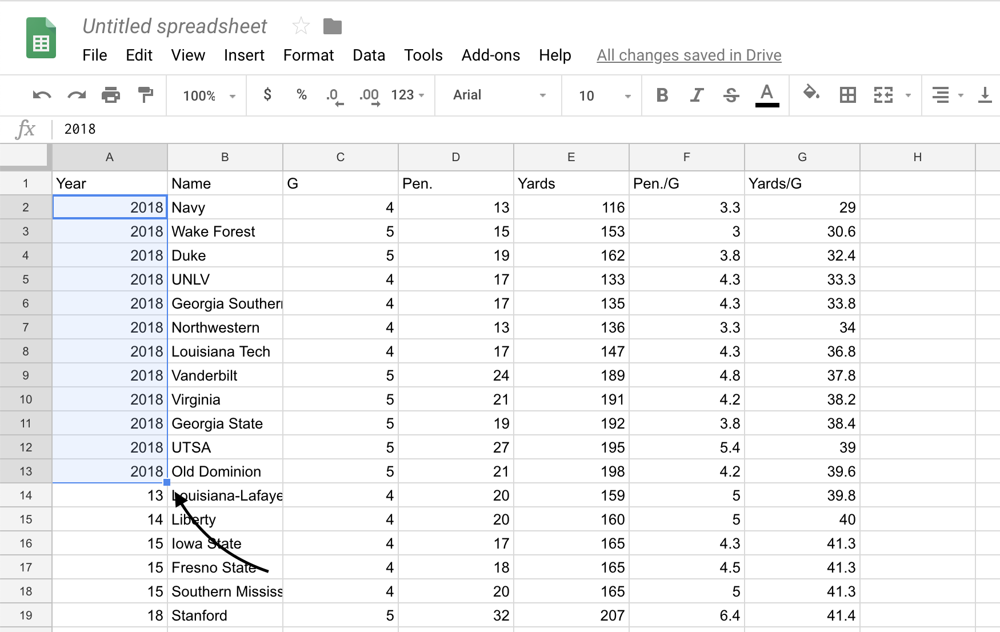

# Line Charts or Why Is Nebraska Terrible?

Bar charts -- stacked or otherwise -- are good for showing relative size of a thing compared to another thing. Line charts, which we work on here, are good for showing change over time. 
So let's look at how we can answer this question: Why is Nebraska terrible right now?

If you ask Scott Frost, according to the Omaha World Herald, this is why they are terrible right now:

"I’m tired of seeing us do the undisciplined things that get us in trouble," Frost said. "We can’t get 15-yard penalties, hitting guys out of bounds, we can’t have penalties on special teams, we can’t have holding calls and guys dancing on the field afterwards.

"We look like an undisciplined team. I’m tired of playing the guys that keep doing that. Because we can’t tell them more times than we have. We have a good enough team to win this game, we’ve got a good enough team to win a bunch of them, but we can’t do that stuff anymore, and I’m tired of watching it."

So let's look at penalty yards. How undisiplined is Nebraska? And is this year worse than others? 

The first thing we need to do is get some data. This is going to be a constant in your work here going forward. 

One good thing about sports is that there's lots of interest in it. And that means there's outlets that put sports data on the internet. Now I'm going to show you a trick to getting it easily. 

The site cfbstats.com takes NCAA stats and puts them online. For instance, [here's their page on penalites](http://www.cfbstats.com/2018/leader/national/team/offense/split01/category14/sort01.html), which you should open now.

Now, in a new tab, log into Google Docs/Drive and open a new spreadsheet. In the first cell of the first row, copy and paste this formula in:

```
=IMPORTHTML("http://www.cfbstats.com/2018/leader/national/team/offense/split01/category14/sort01.html", "table", 1)
```

If it worked right, you've got the data from that page in a spreadsheet. 

But we have only 2018 data. What if we wanted 2017? Well, we could start a new spreadsheet and run it again, changing the year in the URL. But that means we have to do that for each year, and then combine them together ourselves.

But what if we want all of those years? We can combine commands into a single command by wrapping them in {} and putting a semi colon between them. 

```
={IMPORTHTML("http://www.cfbstats.com/2018/leader/national/team/offense/split01/category14/sort01.html", "table", 1); IMPORTHTML("http://www.cfbstats.com/2017/leader/national/team/offense/split01/category14/sort01.html", "table", 1)
}
```
You can connect as many of those as you need. 

**Your turn: We want data from 2009 to 2018. Chain together enough IMPORTHTML steps to get your own dataset. I am not going to provide it to you. Nor will I for the homework.**

### Cleaning the data

The first thing we need to do is recognize that we don't have data, really. We have the results of a formula. You can tell by putting your cursor on that field, where you'll see the formula again.


The solution is easy:

Edit > Select All (command/control A)
Edit > Copy (command/control c)
Edit > Paste Special > Values Only) (command/control shift v)

Now you have data, but you don't have the year the data came from. To fix this, you have to add them yourself. I can calculate ranks, and indeed I may want to use something else for ranks, so I'm going to eliminate it. I'm going to replace it with Year, then I'm going to type the year in the first row. In this case, it's 2018. Then I'm going to copy it all the way down by clicking on the tab in the bottom right of the field, holding it and dragging it down to where the header repeats and the ranks reset. That's my clue that it's a new year. 



Now we're going to use sorting to get rid of anything that's not data. So click on Data > Sort Range. You'll want to check the "Data has header row" field. Then hit Sort.


Now all you need to do is search through the data for where your junk data -- extra headers, blanks, etc. -- got sorted and delete it. After you've done that, you can export it for use in R. Go to File > Download as > Comma Separated Values. Remember to put it in the same directory as your R Notebook file so you can import the data easily.

### Line charts

Let's start getting all that we need. We can use the tidyverse shortcut. 

```{r}
library(tidyverse)
```

Now we'll import the data you created -- penalties by team from 2009 to 2018. Mine looks like this: 

```{r}
penalties <- read_csv("~/Dropbox/SPMC350-Data-Literacy-and-Analytics-in-Sports/Data/penalties.csv")
```

The first thing we need to do is change the Year to a date, because ggplot handles dates better than numbers. We could have done this when we cleaned the data, but it's good to get the practice here. We won't always have this option. The pattern here is name it, set it equal to first as a date, then inside the date create the format. Paste just merges two pieces of data together. This will create a string of text that says 2018-01-01 and then R will format that as a date. We will save this out as a dataframe. 

```{r}
penalties_with_dates <- penalties %>% mutate(Season=as.Date(paste(Year,"-01-01",sep="")))
```

That will give us everything. But we know we want to highlight Nebraska, so we should just query that out now. 

```{r}
nu <- penalties_with_dates %>% filter(Name=="Nebraska")
```

Now we have what we need. Let's chart it. In this case, because we have two different datasets, we're going to put everything in the geom instead of the ggplot step. We also have to explicitly state what dataset we're using by saying `data=` in the geom step. 

First, let's chart everything. Read carefully. First we set the data. Then we set our aesthetic. Unlike bars, we need an X and a Y variable. In this case, our X is the season -- the date data. Y is the thing we want the lines to move with. In this case, the Yards Per Game. With lines, given that we have lots and lots of teams, we need to add a group variable. In this case, it's Name. It'll group each team name on a single line. 

```{r}
ggplot() + geom_line(data=penalties_with_dates, aes(x=Season, y=`Yards/G`, group=Name), color="light grey")
```
Now, by using +, we can add Nebraska to it. 

```{r}
ggplot() + geom_line(data=penalties_with_dates, aes(x=Season, y=`Yards/G`, group=Name), color="light grey") + geom_line(data=nu, aes(x=Season, y=`Yards/G`, group=Name), color="red")
```

But how does that compare to the average? We can add that pretty easily by creating a new dataframe with it and add another geom_line. 

```{r}
mean_by_season <- penalties_with_dates %>% group_by(Season) %>% summarize(mean_penalties=mean(`Yards/G`))
```

```{r}
ggplot() + geom_line(data=penalties_with_dates, aes(x=Season, y=`Yards/G`, group=Name), color="light grey") + geom_line(data=nu, aes(x=Season, y=`Yards/G`, group=Name), color="red") + geom_line(data=mean_by_season, aes(x=Season, y=mean_penalties), color="black")
```

### Extra code to give you a view of things to come. 

Let's clean this up some. First we'll introduce a new library called repr (you'll need to install it) that can change the shape of the output. Now you can make rectangles or graphics that are taller than wide. 

```{r}
library(repr)
options(repr.plot.width=9, repr.plot.height=4)
```

To my chart, I'm going to add labels -- via `labs` -- then I'm going to change those labels by making the headline larger and bold. Also going to make the labels smaller. Then I'm going to annotate the chart by labeling the lines using x and y coordinates. 

```{r}
ggplot() + 
  geom_line(data=penalties_with_dates, aes(x=Season, y=`Yards/G`, group=Name), color="light grey") + 
  geom_line(data=nu, aes(x=Season, y=`Yards/G`, group=Name), color="red") +
  geom_line(data=mean_by_season, aes(x=Season, y=mean_penalties), color="black") +
  labs(x="Season", y="Penalty yards per game", title="Frost: \"We look like an undisciplined team\"", subtitle="Nebraska is tied for dead last in the FBS in penalty yards per game in the 2018 season.", caption="Source: NCAA | By Matt Waite") + 
  theme(plot.title = element_text(size = 16, face = "bold"), axis.title = element_text(size = 8), plot.subtitle = element_text(size=10))  + 
  annotate("text", x=as.Date("2010-01-01"), y=48, label="FBS Average", size=3) +
  annotate("text", x=as.Date("2010-01-01"), y=75, label="Nebraska", size=3)
```

### Assignment

Another area Nebraska is dreadful at? [Converting third downs on offense](http://www.cfbstats.com/2018/leader/national/team/offense/split01/category25/sort01.html).

Gather this data using IMPORTHTML. Pull it into R. Chart how Nebraska has fared since 2009 compared to the rest of the FBS, similar to what you see above. 

#### Rubric

1. Did you gather the data correctly?
2. Did you import it into R Notebook correctly?
3. Did you create the data frames needed to chart correctly?
4. Did you chart it correctly?