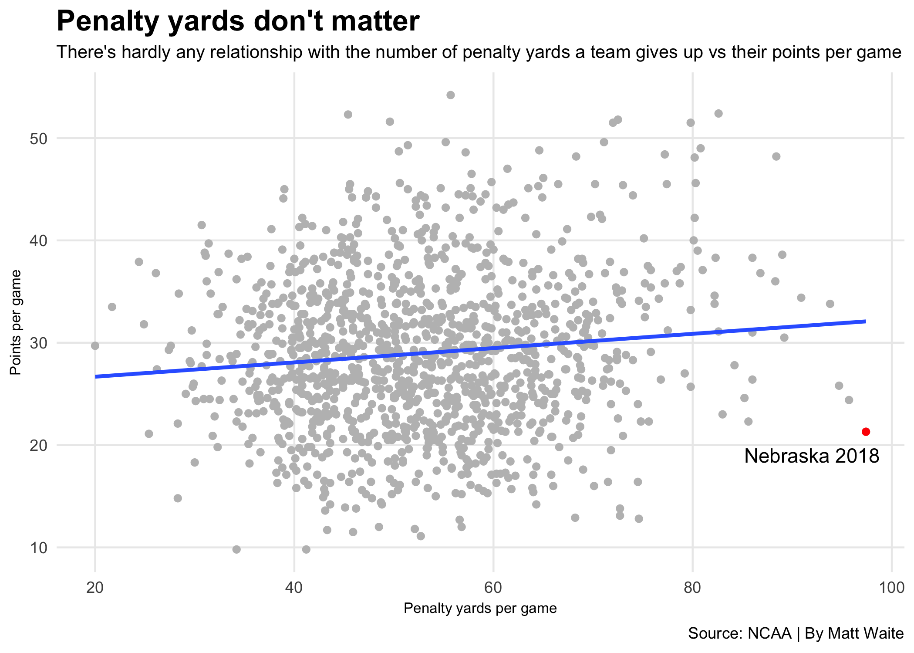
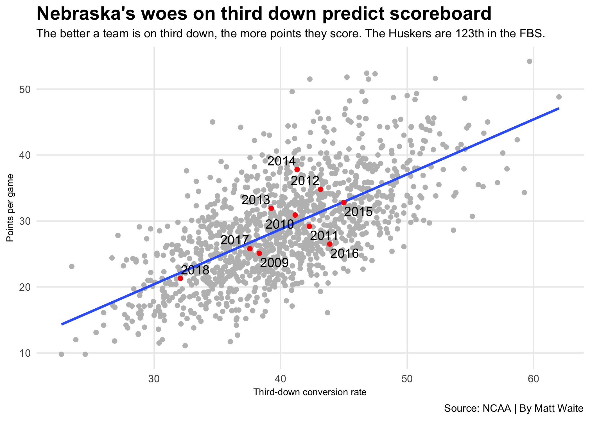
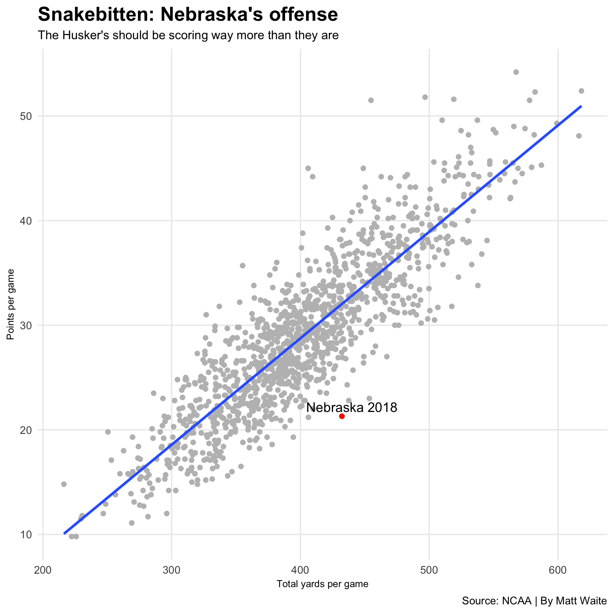
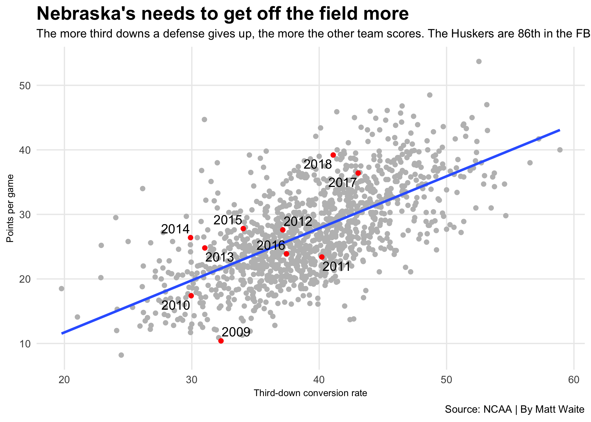

---
output:
  html_notebook: default
  html_document: default
---
# Dear Nebraska media: Stop asking about penalties

A frequent question in Nebraska press conferences lately is the number of penalties the team has piling up. It's easy to see why: The team is dead last in the FBS in the number of penalty yards per game. Worst in major college football. The headlines write themselves.

The problem? It's almost meaningless to the team's success or failure. 

Nebraska is winless, unlikely to make a bowl game and miles from the top 25. They commit more than 10 penalties per game for 97.8 yards per game. It would be easy to blame penalties. But Ohio State, undefeated, ranked third and an FBS playoff contender, commits 8.5 penalties per game for 80.8 yards. They're 120th in the FBS.

So which is it? Do penalties make you a winner or a loser? 

The answer? Neither. They determine very little of the outcome when you look at a whole season. In fact, looking at every FBS team since 2009, there's an even slightly positive effect. You read that right: the more penalty yards, the more points per game a team scores (slightly). Scott Frost even said his teams usually rank higher in penalties because the offense is trying to move fast to score points. 

Using all FBS teams since 2009, for every 10 penalty yards per game a team racks up, you'd expect to score .6 more points per game. 

### What matters? Third down. 

Where the team is falling short, and where it actually matters, is on third down. 

Using a basic linear model and data from every FBS team since 2009, we see that for every percentage point of third down percentage, a team scores .83 points per game. Some teams will over perform that, some will underperform -- big plays, defensive touchdowns and special teams scores will help a team overperform that number, mistakes and poorly-timed penalties will help underperform. But the simple equation for a line will get you close. How close? 

Last Saturday, Nebraska converted on just 3 of 10 third downs against Wisconsin. Given that conversion percentage, our model says Nebraska should have scored 20.4 points. Wisconsin was better, converting 6 of 12. Our model says they should should have scored 37.1 points. 

Final score: Wisconin 41, Nebraska 24. 

### Unlucky or bad?

So how much is that third-down percentage hurting Nebraska? If they were an average FBS school since 2009, they'd score almost 11 more points per game than they are now. 

The Huskers are running up 432.2 yards per game this season. That's a lot for an 0-6 team. And it's a ton for a team averaging 21.3 points per game. If you took every offense since 2009 in the FBS, and gave them 432.2 yards per game, you would expect them to score 32 points per game. 

### It's not just the offense

Nebraska's defense, by many accounts, is better this year than last year except where it counts: on the scoreboard. They are better that last year's defense on third down percentage -- 41.1 to 43.06 -- but they're giving up 39.2 points per game this season where they gave up 36.4 points per game. 

Nebraska's best defenses since 2009 -- including the 2009 defense that was one of the best in school history -- have all been stingy on third down. That 2009 defense allowed only 10.4 points per game -- best in the FBS. It allowed opponents to convert on 32 percent of third downs -- which means they overperformed the model by quite a ways. The 2010 defense fit much closer to the model but still overperformed -- it allowed only 30 percent of third downs to convert, and gave up just 17.4 points per game. 

So for Nebraska to win, the numbers say little else matters more than getting better on third down.
